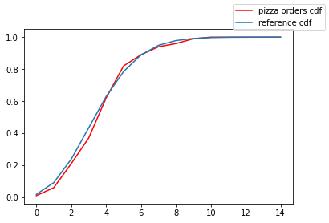

<link rel="stylesheet" href="/assets/css/main.css"/>

The first chapter covers a lot of topics

## Random Sums
Suppose $\(X_n\)_{n\geq 1}$ is a sequence of idd non-negative integers random variables and let \\(N\\) be a random non-negative integer too which is independent of the sequence. 

The random sum is the process defined as 
\\[S_N = X_1 + \cdots + X_N\\]

And the most substantial result in this section is
\\[
P_{S_N}(s) = P_N(P_{X_1}(s))   \label{cgf}
\\]

In the next example we'll verify this result empirically

### Example 1: Pizza Orders

You're a drunk pizza delivery guy that has a \\(p\\) probability of handle the pizza to the correct address. The situation can be modeled by 

```python
def pizza_orders(mu, p):
    orders = int(dist.Poisson(mu).sample().item())
    correct_orders = 0
    for order in range(int(orders)):
        correct_orders += pyro.sample('correct_order', dist.Bernoulli(p))
    return correct_orders
```

<figure>  
   
   <figcaption>Fig 1. Pizza Orders</figcaption>
</figure>

