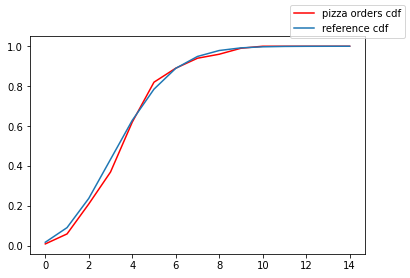

<link rel="stylesheet" href="/assets/css/main.css"/>

The first chapter has a bit of everything. It's a walkthrough on all the basic concepts of random variables and discrete time stochastic processes. Nevertheless it has a lot of useful and classical examples with step by step explanations.   

## Generating Functions

Generating functions (g.f) are a super useful tool to deal with sequences and particularly with mass probability functions. If \\(X\\) it's a random non-negative integer valued variable with density \\((p_n)\\), its g.f is the power series
\\[
P_X(s) = \sum_{j=0}^{\infty}a_js^j \tag{1.1}
\\]
There are two properties we'll use across the section. From now on, when we talk about a random variable we assume is non-negative and integer, unless we say the opposite.  

1. Given \\(X_1, X_2\\) independent random variables, the g.f of their sum follows
   \\[
   P_{X_1+X_2}(s)=P_{X_1}(s)P_{X_2}(s) \tag{1.2}
   \\]
   It will allow us to understand the distribution of the sum in a very simple manner.

2. Suppose \\((X_n)_{n\geq 1}\\) is a sequence of idd random variables and \\(N\\) a random integer which is independent of the sequence too. 

   The generating function of the random sum  

\\[
S_N = X_1 + \cdots + X_N \tag{1.3}
\\]

can be computed as
\\[
P_{S_N}(s) = P_N(P_{X_1}(s)) \tag{1.4}
\\]
Let's see an example with code

### Example 1: Pizza Orders 

[*Harry Delivery Pizzas, p.16*] Harry works taking orders at a pizza restaurant. He suffer big hangovers on Saturdays, so he only have a \\(p\\) probability of righting down the correct address when someone call. If there are Poisson \\(p(\mu)\\) calls on Saturday. What is the distribution of the right delivered pizzas?


```python
import pyro
import pyro.distributions as dist
from statsmodels.distributions.empirical_distribution import ECDF
from scipy.stats import poisson
import matplotlib.pyplot as plt
import numpy as np

pyro.set_rng_seed(308)
```

This situation can be modeled by sampling \\(n\\) times from a Bernoulli variable, where \\(n\\) comes from the Poisson \\(p(\mu)\\)   

```python
class pizza_orders:
    def __init__(self, mu, p):
        self.orders_dist = dist.Poisson(mu)
        self.binary = dist.Bernoulli(p)
        
    def sample(self):
        n_orders = int(self.orders_dist.sample().item())
        correct_orders = 0
        for order in range(n_orders):
            correct_orders += self.binary.sample().item()
        return correct_orders
```

Just a little note about the code. At first glance it seems unnecessary to put the `sample` method inside a class. I did it because in this way I don't need to pass the parameters \\(\mu\\) and \\(p\\) if another function call `sample` , just like in the chunk below.  

Using equation (1.4) it can be proved the distribution of `pizza_orders` is a Poisson with parameter \\(\mu\cdot p\\). Let's verify that by comparing the empirical cumulative distribution function of our model with the expected Poisson c.d.f. 

```python
def ecdf_gen(distribution, n): 
    samples = []
    for _ in range(n):
        samples.append(distribution.sample())
    return ECDF(samples)
```

Above we have a little wrapper to compute the ecdf for a `distribution` class with a `sample` method.

```python
#set the distributions
mu, p = 10, .4
reference = poisson(mu * p)
saturday_orders = pizza_orders(mu, p)

#compute both cdf
x = [i for i in range(15)]
ecdf = ecdf_gen(saturday_orders, 30)
ecdf_values = ecdf(x)
reference_cdf_values = reference.cdf(x)
```

Plot and see the results 

```python
fig = plt.figure()
ax = fig.add_subplot(1, 1, 1)
ax.plot(x, ecdf_values, c='red', label = 'pizza orders cdf')
ax.plot(x, reference_cdf_values, label = 'reference cdf')
fig.legend()
plot.show()
```

<figure>  
   
   <figcaption>Fig 1. Pizza Orders</figcaption>
</figure>

The plot show us `pizza_orders` has the expected behavior.

## Branching Process

The branching process is a classical example of random sums. Imagine a population starts with one individual which have a \\(p_k\\) probability of splitting into \\(k\\) offspring (There could be more than one, we'll talk more about that later). Each member of the new generation, also follow the same pattern of splitting. The process continues until there is no individuals to split, that is, until the population extinguish.

Let's simulate the process 

```python
class branching:
    def __init__(self, density):
        self.density = density
        self.pop = 1
        
    def next_gen(self):
        new_pop = 0
        for _ in range(self.pop):
            new_pop += self.density.sample().item()
        self.pop = int(new_pop)
        
    def process(self, tolerance):
        while self.pop > 0 and self.pop <= tolerance:
            self.next_gen()
            
    def reset(self):
        self.pop = 1
```

One of the main reasons to study this process is to know whether the population disappear or not and what's the probability of that happen. 

If \\(Z\sim (p_k)\\) is the offspring distribution, with g.f \\(P\\), it can be proved that the smallest solution of the equation
\\[
P(s) = s \tag{1.5}
\\]
is equal to the probability of extinction, whenever \\(E(Z) \geq 1\\), and it's equal to \\(1\\) otherwise.

It's worth emphasizing that we need to stop the process at some point because either the population extinguish or explodes:
\\[
\textbf{P}(Z_n\rightarrow 0) = 1 - \textbf{P}(Z_n\rightarrow \infty) \tag{1.6}
\\]
One question that arise from (1.6) is if we can compute a threshold of population that when is reached the process can't return and go to infinity no matter what. It turns out there is no such threshold: there is always a chance of extinction, but we can set a point when this probability is super small. For example, suppose the density comes from a binomial \\(b(2, .6)\\). If at any step there are 10 individuals in the population then the probability of extinction is order of \\(10^{-8}\\). How can you compute it? If there are \\(n\\) individuals in one offspring, using the independency, the fact the individuals follows the same distribution and (1.2), the probability of extinction is the smallest solution of  
\\[
P^n(s)=s \tag{1.7}
\\]
Now let's take a bunch of samples from our branching process and see how many of them goes to extinction

```python
binomial = dist.Binomial(2, .6)
branch = branching(density=binomial)
results = {'extinction': 0, 'explode': 0}

for _ in range(1000):
    branch.process(tolerance = 10)
    if branch.pop == 0:
        results['extinction'] += 1
    else:
        results['explode'] += 1
    branch.reset()
    
print(results)
```

`
{'extinction': 443, 'explode': 557}
`

According to (1.5), the extinction probability is approximately \\(0.44\\). 


